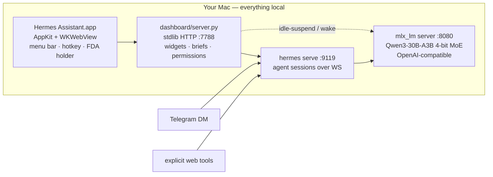

<div align="center">

# Hermes Assistant

**Your Mac becomes a private, always-on AI assistant.**

A standalone, Mac-first desktop app: a native AppKit shell around a local
tool-calling agent, a local MLX model, and a Liquid-Glass dashboard.
**Every token is generated on your machine.**

[](LICENSE)

-6b8afd)


*Live hub · news framing comparison · trend radar · local chat — model asleep in the corner, saving 22 GB of RAM.*

</div>

---

## Why

Cloud assistants know everything about you and forget you between sessions.
Hermes flips it: a **[Hermes agent](https://github.com/NousResearch/hermes-agent)
driving a ~30B MoE model on your own Apple Silicon**, with persistent memory,
graduated permissions, and a dashboard that's alive all day — briefing you,
watching your feeds, and acting on your Mac *with receipts for every action*.

No inference API keys. No token bills. No transcript leaves the machine.

## What it does

- 🖥 **Standalone Mac app** — native AppKit/WebKit shell that launches and
  babysits its own local services; menu-bar dropdown (weather · model state ·
  system meters) + global-hotkey Quick Ask (⌃⌥Space).
- 📰 **World Brief** — an 8 am daily brief, midday pulse, breaking alerts, and
  an evening wrap, from a curated **full-spread** of feeds (wire · public ·
  left · right · Mideast), hard-filtered to the last 24 h.
- 🔍 **Every Lens** — the same story as framed by each outlet's lean,
  side-by-side. *"Hardline war backer dies"* vs *"Trump ally dies"* — spot the
  spin instead of absorbing it.
- 📈 **Trend Radar** — which topics are *accelerating* across your feeds,
  from a rolling daily ledger. No model calls needed.
- 😴 **Idle-suspend** — the model server sleeps after 10 idle minutes
  (frees ~22 GB) and transparently wakes on your next message.
- 🧠 **Visible, editable memory** — read, edit, and delete what the agent
  remembers about you. A flight recorder logs every tool call with one-click
  undo where possible.
- 🛡 **Graduated trust** — 17 action classes, each Auto / Ask / Never, with
  hard floors. Nothing irreversible runs without your click.
- 🗺 **Code knowledge graph** — optional [Graphify](https://github.com/Graphify-Labs/graphify)
  integration maps the repo into a queryable graph, synced to Obsidian as
  interlinked notes (`obsidian_sync.py`, `obsidian_daily.py`).
- 📊 **Modular widget hub** — 20+ widgets (markets, HN, GitHub trending, RSS,
  iMessage, Claude-plan usage…), each with a rich pop-out; add/remove/reorder.

## Architecture



- **Model:** Qwen3-30B-A3B MoE (4-bit MLX) — frontier-ish tool-calling at
  ~3 B-active speed, ~18 GB resident. Swappable from the dashboard (model
  menu handles download → verify → promote).
- **Backend:** one `server.py` on the Python stdlib — no pip tree to rot.
  Features arrive as drop-in `aux_*.py` / `aux_*.js` modules.
- **Safety:** manual approvals by default, notify-only automations,
  read-only integrations where it matters (Gmail is draft-only *by absence
  of send capability*, not by promise).

## Quick start

> Requires an Apple Silicon Mac (64 GB recommended for the 30B; lighter
> models fit 16–32 GB) and macOS 13+.

```bash
git clone https://github.com/Emran05/hermes-assistant-local.git && cd hermes-assistant-local

# 1 · local model server
pip install mlx-lm 'transformers<5'        # transformers must stay <5 (mlx-lm quirk)
./mlx-server.sh                            # serves :8080, first run downloads the model

# 2 · the agent  (github.com/NousResearch/hermes-agent)
#     point its config at http://127.0.0.1:8080/v1 — see config.yaml

# 3 · secrets — copy the template, fill in your own values, never commit it
cp env.example ~/.hermes/.env && chmod 600 ~/.hermes/.env

# 4 · always-on services (model · dashboard · serve) + the native app
./install-services.sh
./app/build-app.sh                         # → /Applications/Hermes Assistant.app
```

Open **Hermes Assistant.app** — the hub is at `http://127.0.0.1:7788` if you
prefer a browser. `CLAUDE.md` holds the full architecture notes and a
hard-won-gotchas list; `RUNBOOK.md` covers operations.

## Design

The UI is a custom **Liquid Glass** system tuned for WKWebView: backdrop
blur + saturation, inset speculars, hairlines, an ambient aurora the glass
refracts. Bespoke two-tone SVG glyphs everywhere — **zero emoji in the app**,
12-hour time, per-category accent colors, `prefers-reduced-motion` respected.

## Roadmap

- [ ] **One-download `.app`** — bundle model bootstrap + services into the app
      (no `install-services.sh` step); signed DMG.
- [ ] Voice in/out (local STT/TTS).
- [ ] Agent-authored widgets from a declarative `{url, template}` spec.
- [ ] Speculative decoding (~4× throughput on MLX) + KV-cache quantization.
- [ ] Screenshot-grounded computer use with snapshot/undo on every action.

## Credits

Standing on: [NousResearch Hermes](https://github.com/NousResearch/hermes-agent) ·
[Apple MLX](https://github.com/ml-explore/mlx) ·
[Qwen](https://huggingface.co/Qwen) ·
[Graphify](https://github.com/Graphify-Labs/graphify)

## License

MIT — see [LICENSE](LICENSE). Placeholders like `123456789`,
`@your_hermes_bot`, and `/Users/you` are yours to fill in.

<div align="center">

**If a private, always-on Mac assistant is something you want to exist — ⭐ this repo.**

</div>
