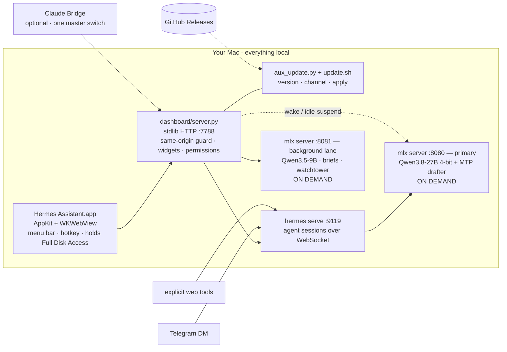

<div align="center">

# Hermes Assistant

**Your Mac becomes a private, always-on AI assistant.**

A standalone, Mac-first desktop app: a native AppKit shell around a local
tool-calling agent, a local MLX model, and a Liquid-Glass dashboard.
**Every token is generated on your machine.**

[](LICENSE)
[](https://github.com/Emran05/hermes-assistant-local/releases)
[](https://github.com/Emran05/hermes-assistant-local/actions/workflows/ci.yml)

-6b8afd)


*Live hub · news framing comparison · trend radar · local chat — model asleep in the corner, saving 22 GB of RAM.*

</div>

---

## Why

Cloud assistants know everything about you and forget you between sessions.
Hermes flips it: a **[Hermes agent](https://github.com/NousResearch/hermes-agent)
driving a 27B model on your own Apple Silicon**, with persistent memory,
graduated permissions, and a dashboard that's alive all day — briefing you,
watching your feeds, and acting on your Mac *with receipts for every action*.

No inference API keys. No token bills. No transcript leaves the machine.

## What it does

- **Standalone Mac app** — a native AppKit/WebKit shell that launches and
  babysits its own local services; menu-bar dropdown (weather · model state ·
  system meters) and a global-hotkey Quick Ask (⌃⌥Space).
- **World Brief** — an 8 am daily brief, a midday pulse, breaking alerts and an
  evening wrap, from a curated full spread of feeds (wire · public · left ·
  right · Mideast), hard-filtered to the last 24 hours.
- **Every Lens** — the same story as framed by each outlet's lean, side by side.
  *"Hardline war backer dies"* vs *"Trump ally dies"* — spot the spin instead of
  absorbing it.
- **Trend Radar** — which topics are *accelerating* across your feeds, from a
  rolling daily ledger. No model calls needed.
- **Two model lanes, both on demand** — a 27B primary for you, a small 9B for
  background work, neither running until something actually needs it.
- **Idle-suspend** — the primary sleeps after 10 idle minutes (frees ~22 GB) and
  wakes transparently on your next message.
- **Visible, editable memory** — read, edit and delete what the agent remembers
  about you. A flight recorder logs every tool call with one-click undo where
  possible.
- **Graduated trust** — 17 action classes, each Auto / Ask / Never, with hard
  floors. Nothing irreversible runs without your click.
- **Code knowledge graph** — optional [Graphify](https://github.com/Graphify-Labs/graphify)
  integration maps the repo into a queryable graph, synced to Obsidian as
  interlinked notes (`obsidian_sync.py`, `obsidian_daily.py`).
- **Modular widget hub** — 20+ widgets (markets, HN, GitHub trending, RSS,
  iMessage, Claude-plan usage…), each with a rich pop-out; add, remove, reorder.
- **Updates that come to you** — Settings › System & Data checks GitHub
  Releases, shows the notes, and applies the update with a live log.

## Architecture



- **Model:** Qwen3.8-27B (4-bit MLX) with its native speculative drafter —
  roughly twice the decode speed, ~17 GB resident. Swappable from the dashboard;
  the model menu handles download → verify → promote.
- **Backend:** one `server.py` on the Python standard library — no pip tree to
  rot. Features arrive as drop-in `aux_*.py` / `aux_*.js` modules.
- **Safety:** manual approvals by default, notify-only automations, read-only
  integrations where it matters (Gmail is draft-only *by absence of a send
  capability*, not by promise), and a same-origin guard in front of the whole
  local API.

### Prompt budget

Every **new** conversation starts by prefilling the same fixed prompt: the
system prompt, the skills index, and a JSON schema for every tool the agent can
call. Prefill is compute-bound, so those tokens are seconds of waiting — and
they are paid once per conversation, not once per message (every later turn in
the same conversation is ~0.2 s off the prefix cache).

Measured on this Mac with `hermes prompt-size --platform tui --json` plus the
agent's own tool registry:

| Profile | Tools | Tool schemas | Whole prefix | First token | Saved |
|---|---|---|---|---|---|
| **Full** (default) | 33 | 53.8 KB | ~21,142 tokens | ~28.2 s | — |
| **Balanced** | 22 | 46.7 KB | ~19,127 tokens | ~25.5 s | ~10 % |
| **Focused** | 19 | 30.5 KB | ~14,521 tokens | ~19.4 s | ~31 % |

The tool schemas are the single largest item — bigger than the system prompt and
the skills index put together.

- **Balanced** keeps everything a personal assistant on a Mac normally uses (web
  search, terminal, files, code execution, skills, todo, memory, session search,
  clarify, delegation, vision, screen control) and drops browser automation —
  twelve schemas, the largest toolset — along with text-to-speech, image and
  video generation, X search, cron jobs, Home Assistant, Spotify, Discord and
  the context engine. This is what a new install starts on.
- **Focused** is Balanced minus the three remaining heavyweight schemas:
  `session_search` (5.9 KB), `delegate_task` (5.5 KB) and `computer_use`
  (5.2 KB). It still reads and writes files, runs commands and code, searches
  the web, sees images and uses its skills — it gives up **screen control,
  sub-agents, and searching past conversations from inside a chat**. The
  dashboard's own conversation list, Settings search and local index are
  unaffected: none of them goes through an agent tool.

Change it in **Settings › Agent & Models › Prompt budget**: pick a profile, or
open *Advanced* and tick the toolsets yourself, with the schema size shown
next to each one. Applying writes `platform_toolsets.cli` in
`~/.hermes/config.yaml` after making a timestamped backup, and the next new
conversation picks it up with no restart. Full is always one click away.
(Balanced is written under the config name `lean`, which is what it shipped as.)

Two honest caveats, both visible in the card:

- The key is `platform_toolsets.cli`, not `.tui`. `hermes serve` resolves a new
  session's tools through `_load_enabled_toolsets`, whose config fallback reads
  the `cli` platform key — there is no `tui` entry in the agent's platform
  table, so a `platform_toolsets.tui` block would be read by nothing. The same
  key therefore also applies to background runs (briefings, the watchtower) and
  to `hermes` in a terminal; they load the same tools and pay the same prefill.
- `hermes prompt-size` reports the tool **ceiling**, not your platform's set —
  it builds an inspection agent with no toolset filter, so its tool figure does
  not move when you change this. The card measures the real set the same way
  (`json.dumps(defs, ensure_ascii=False)`), which is why the two agree on Full
  and differ on Lean.

### Context meter and compaction

The prompt budget is what a **new** conversation costs. This is what an **old**
one costs: a conversation grows with every turn, and when it approaches the
model's window the agent summarises the earlier part of it and carries on. That
is a compaction, and it is the moment detail gets quietly lost.

After each finished turn a chip appears next to the model pill:

```
26.9k ctx · 96 % cached · 9.8 s prefill
```

— the context the turn ended at, how much of it the prefix cache served for
free, and the prefill seconds that bought. It turns amber past 70 % of the
window and red past 90 %. Hover it for the full numbers, including how many
model requests the turn actually took (a tool loop re-sends the whole
conversation after every tool result, so one turn is often five requests).

Nothing is measured by asking the model — no model is ever started for this.
The MLX server logs `Prefill completed` and `Request completed` for every
request to `~/.hermes/logs/mlx-server.log`, and the dashboard reads the tail of
that file, reusing the parser from `tools/bench/prompt_size.py`. Requests are
matched to a turn by time, and to the conversation lane by `stream=True` (the
auxiliary traffic that shares the same server — conversation titles, the
summariser itself — is `stream=False` and two orders of magnitude smaller).

When a compaction happens, the status line reads **Compacting context** while it
runs and the transcript keeps a one-line note afterwards:

> Context compacted — prompt went from 31.2k to 12.4k tokens

**Settings › Agent & Models › Context & compaction** shows the window, the four
knobs and the last ten turns as a table:

| Setting | Range | What it does |
|---|---|---|
| Compact at | 0.3 – 0.9 | When to compact, as a fraction of the window |
| Summarise down to | 0.1 – 0.5 | How small the summary comes out, as a fraction of that threshold |
| Keep the last | 2 – 60 | Recent messages that are never summarised |
| Keep the first | 0 – 10 | Opening messages that are never summarised |

Defaults are 0.5 / 0.2 / 20 / 3. With a 65,536-token window that is a
compaction at 32,768 tokens, summarised down to roughly 6,553. Applying writes
the `compression` block of `~/.hermes/config.yaml` after a timestamped backup;
a no-op leaves the file byte-identical, and the next **new** conversation picks
the values up with no restart (an open one keeps the compressor it was built
with). The card also names the model doing the summarising —
`auxiliary.compression.model` if you set one, otherwise the main model.

`GET /api/context/recent?n=20`, `GET /api/context/turn?job=<id>` and
`GET/POST /api/context/compression` for scripts.

### Tool output budget

Prompt budget is the *fixed* cost of a conversation. This is the *variable*
one: every tool result is appended to the transcript exactly as the tool
produced it, so a single `read_file` of a build log, a chatty `terminal`
command or a large page can spend a quarter of the 65,536-token window in one
turn — and every later turn in that conversation prefills it again.

The agent caps three tools on its own, with three different numbers and three
different config keys: `terminal` at 50,000 chars, `read_file` at 100,000, and
`web_extract` at 15,000 (that one already stores the full page and hands back
a pointer). `search_files`, `web_search`, `session_search`, `process`,
`execute_code`, `memory` and every MCP or plugin tool are uncapped. And even
the capped ones are sized per tool rather than against the window — 100,000
chars is about 28,000 tokens, 42 % of the context, in one result.

**Tool output budget** is the floor underneath all of that, applied at the one
seam every tool result passes through, and quoted as a share of your context
window:

| Budget | Tokens | Share of a 65k window |
|---|---|---|
| 8k chars | ~2,200 | 3.4 % |
| 16k chars | ~4,400 | 6.8 % |
| **24k chars** (default) | ~6,700 | **10.2 %** |
| 48k chars | ~13,300 | 20.3 % |

Over the budget, the start and the end are kept and the middle is replaced by
a marker. The split is biased per tool: `terminal`, `process` and
`execute_code` keep 35 % head / 65 % tail, because a command's exit status and
stack trace are at the end; files, pages and search results keep 65 % / 35 %.
Cuts land on line boundaries, and a result that is valid JSON is kept **whole**
if minifying it gets under the budget — a parseable result is worth more intact
than head-and-tailed.

The full, untrimmed output is written to
`~/.hermes/dashboard/spill/<date>/<tool>-<id>.txt` (0600, kept seven days) and
the marker names the path, so nothing is lost:

```
[… 3,921 lines / 277,347 chars omitted by tool-budget — full output saved to
~/.hermes/dashboard/spill/2026-09-07/terminal-360b8bbf.txt; use read_file with
an offset, or search_files on it — the tool SUCCEEDED and its output was
complete; this text was TRUNCATED to fit the context window, it is not an
error and not a partial result …]
```

That last clause is the point. A model that sees an ellipsis and concludes the
command failed will simply run it again — truncated is not incomplete, so the
marker says so in words.

It runs **inside the agent**, as a plugin (`hermes-plugins/tool-budget`, hooked
on `transform_tool_result`), not in the dashboard — so it applies to the hub,
to Telegram, to `hermes` in a terminal and to background runs alike. `install.sh`
and `update.sh` link it into `~/.hermes/plugins` and add it to
`plugins.enabled` in `~/.hermes/config.yaml` (once, after a timestamped
backup); **Settings › Agent & Models › Tool output budget** does the same on
demand and is where you change the size, turn it off, or stop saving full
outputs. Plugins load when the agent backend starts, so switching it on needs
one restart of that service; changing the size or turning it off does not —
the plugin re-reads `settings.json` on the next tool call. `GET/POST
/api/tool/budget` for scripts, and every truncation is one JSON line in
`~/.hermes/dashboard/tool-budget.jsonl`, which is where the card's savings
figure comes from.


## Requirements

- A Mac with **Apple Silicon** (M-series). There is no Intel path — MLX runs on
  the Apple GPU.
- **macOS 14** (Sonoma) or newer.
- **Xcode command line tools**: `xcode-select --install`.
- **Python 3.12+** on your PATH. The dashboard is stdlib-only, but it needs a
  modern one.
- **~25 GB of free disk** for the default model, and enough RAM to hold it —
  32 GB is comfortable, 64 GB is roomy. The model servers sleep when idle, so
  they only cost RAM while you are actually using the assistant.
- The **[Hermes Agent](https://github.com/NousResearch/hermes-agent) CLI**,
  installed separately (`install.sh` tells you how if it is missing).

## Install

```bash
git clone https://github.com/Emran05/hermes-assistant-local.git ~/HermesAssistant
cd ~/HermesAssistant
./install.sh --app
```

That preflights your machine, seeds `~/.hermes/.env` and `~/.hermes/config.yaml`
from the templates (never overwriting existing ones), builds the app, and
installs the launchd services. Run `./install.sh --dry-run` first if you want to
see the plan without touching anything.

Then:

1. `$EDITOR ~/.hermes/.env` — at minimum `TELEGRAM_BOT_TOKEN` and
   `TELEGRAM_ALLOWED_USERS` if you want the Telegram reach-in. `RUNBOOK.md`
   walks through every integration.
2. Open the dashboard at <http://127.0.0.1:7788>, or launch **Hermes
   Assistant.app**. Setup runs on first launch — it reads your Mac's chip, RAM
   and free disk, shows exactly what ever leaves the machine, recommends a model
   that fits, and sets your preferences (re-runnable from Settings › Overview).
3. Pick a model in the header pill and let it download the first time (~17 GB).

**First launch of the app.** The bundle is ad-hoc signed, not notarised by
Apple, so double-clicking shows *"cannot be opened because the developer cannot
be verified"*. Right-click (or Control-click) **Hermes Assistant.app** in
`/Applications` → **Open** → **Open**. macOS remembers the choice.

**Full Disk Access.** The Message Center reads `~/Library/Messages/chat.db`,
which macOS protects. Grant it in **System Settings › Privacy & Security › Full
Disk Access › + › Hermes Assistant.app**, then relaunch. Note that *rebuilding*
the app changes its ad-hoc signature, so macOS treats it as a new app — you must
remove and re-add it there after every rebuild.

## Updating

Two paths, same script underneath:

- **Settings › System & Data › Software update** — shows your version, checks
  GitHub Releases, renders the release notes, and applies the update with a live
  log. The dashboard restarts itself and the app window reloads when it
  reconnects.
- **`./update.sh`** in the install directory, from a terminal. Add `--dry-run`
  to see the plan, `--target v1.1.0` for a specific release, `--rebuild-app` to
  also replace the app bundle.

Two channels, in Settings or via `--channel`:

| Channel | What it tracks |
|---|---|
| `stable` (default) | the newest `vX.Y.Z` release tag |
| `main` | `origin/main`, the development branch — git checkouts only |

The updater refuses to move a checkout with uncommitted changes (it tells you
which files), never touches anything under `~/.hermes`, leaves the model servers
asleep, and logs to `~/.hermes/logs/update.log`. If a release changes `app/`, it
says so rather than silently replacing a bundle whose Full Disk Access grant
would be dropped.

## Use Hermes as context in Claude Code

Hermes can act as a **personal context MCP server**: another agent on this Mac —
Claude Code, primarily — asks Hermes what it already knows instead of re-reading
your calendar, notes and conversations for itself.

```bash
claude mcp add hermes-assistant -- python3 /path/to/HermesAssistant/dashboard/hermes_mcp.py
```

That is the whole install. There is no extra daemon: Claude Code launches the
script, it speaks JSON-RPC over stdin/stdout, and it exits when the client does.
It is stdlib-only Python, so whatever `python3` you have will run it. The Hermes
dashboard has to be running (it normally is — it's a launchd agent); if it
isn't, every tool says so and tells you how to start it.

### The tools that appear

| Tool | What it answers |
|---|---|
| `hermes_search(q, source?, limit?)` | one search across chats, notes, calendar and saved news |
| `calendar_next(hours=24)` | what is coming up, out to a week |
| `calendar_search(q)` | calendar events by title, about ±30 days |
| `notes_search(q)` | the Scratchpad |
| `chats_search(q)` | past Hermes conversations — returns a session id |
| `chat_get(session, last_n=20)` | the last turns of one conversation |
| `needs_you()` | the now / today / later buckets, with the reason for each |
| `memory_get()` | the facts Hermes remembers about you |
| `messages_search(q)` | iMessage rows — **off by default** |

### The allowlist

Scope is decided once, by you, at launch — never negotiated at runtime by a
model. `~/.hermes/mcp-allow.json` is created on first run, mode `600`:

```json
{
  "max_results": 20,
  "tools": {
    "hermes_search": true,
    "calendar_next": true,
    "calendar_search": true,
    "notes_search": true,
    "chats_search": true,
    "chat_get": true,
    "needs_you": true,
    "memory_get": true,
    "messages_search": false
  }
}
```

A tool set to `false` is **not listed and not callable** — the model is never
told it exists. The file is read once at startup, so an edit takes effect the
next time your client starts the server. A corrupt file falls back to these
defaults, never to "allow everything".

### Privacy posture

- **Loopback only.** Every tool is an HTTP GET against the dashboard on
  `127.0.0.1:7788`. The server opens no port of its own, reads no store
  directly, and never touches the network.
- **Read-only.** There is no tool that writes, sends, drafts, snoozes or
  approves anything, and nothing here can wake a model.
- **Messages stay off until you say otherwise** — and while they are off,
  message rows are filtered out of `hermes_search` as well, so turning the tool
  off is not a hiding place.
- **Conversations are scrubbed on the way out**: tool calls, approval prompts
  and status rows are dropped, and tokens, `Bearer` headers and `~/.hermes`
  paths are redacted with the same rules the conversation export uses.
- **Bounded plain text.** Any single result is capped at 8 KB, and a non-JSON
  answer from the dashboard is discarded rather than forwarded — no HTML ever
  reaches the model.

`needs_you()` reads the inbox with `mark=0`, so asking Claude Code what needs you
never counts as a sighting for the "now precision" trust metric — only what a person
actually saw in the Hub feeds it.

## Privacy

- **All inference is local.** Prompts, replies, memory and your calendar and
  mail content stay on the machine. The model server is a process on
  `127.0.0.1`, not an API key.
- **What does go out**, and only when you ask for it: Telegram transport (if you
  set it up), explicit agent tool calls like web search, weather and news feeds
  for the hub widgets, and the update check against the GitHub API.
- **The optional Claude Bridge** is the one path that sends text to a hosted
  model. It is off unless you turn it on, behind a single master switch.
- **The optional "Uncensored" model** (`Qwen3.8-27B-Uncensored`) is an
  abliterated build with its refusal behaviour removed. It is **opt-in**, never
  the default, and you pick it deliberately in the model menu. It is the same
  27B otherwise. What it writes is yours to own.
- **Google access is read-and-draft**: `calendar.readonly`, `gmail.readonly`,
  `gmail.compose`. There is no send scope, by design.
- **Battery.** The two model servers are installed **on demand**: they do not
  start at login and are not kept alive. A chat turn, a Telegram message, or
  "Wake now" starts the primary (~30-50 s cold); after ten idle minutes it
  suspends itself and hands back its ~22 GB. That is why the first message after
  a while is slow — it is not stuck.

## Design

The UI is a custom **Liquid Glass** system tuned for WKWebView: backdrop blur
and saturation, inset speculars, hairlines, and an ambient aurora the glass
refracts. Bespoke two-tone SVG glyphs everywhere — **zero emoji in the app** —
12-hour time, per-category accent colours, and `prefers-reduced-motion`
respected.

## Troubleshooting

### Doctor

One command, one screen. Before you go log-diving, ask it what is wrong:

```bash
python3 dashboard/doctor.py            # the report
python3 dashboard/doctor.py --quiet    # only what needs attention
python3 dashboard/doctor.py --json     # the same run, machine-readable
```

Eighteen checks in about a quarter of a second: the dashboard and the launchd
services, the Hermes Agent and its version, the mlx-vlm venv and its pin, the
Python that does model downloads, every model in the roster (weights complete,
drafter ready, fits this Mac's RAM), free disk, RAM, macOS, Apple Silicon, Full
Disk Access, `config.yaml` / `settings.json` / `~/.hermes/config.yaml`, the
Claude bridge and its master switch, the search index, the Needs-you store,
first-run setup, the cached update check, and the log directory plus a count of
recent errors.

| Status | Means |
| --- | --- |
| `PASS` | Nothing to do. |
| `WARN` | It works, but something is degraded or unset — the line under it is the fix. |
| `FAIL` | Something is broken now. The line under it is the fix. |

Exit code is **0** when nothing failed and **1** otherwise, so it drops into a
shell `&&` chain or CI. The same run is served at
`GET /api/doctor` (`?format=text` for the report) and rendered as the **Health**
card in Settings › System & Data, which also has a "Copy report" button.

Every check is read-only and **none of them can start or wake a model server** —
launchd is only ever `list`ed, the model lanes are HTTP probes, and nothing is
written. It is safe to run on battery.

### Quick ones

Start with **[RUNBOOK.md](RUNBOOK.md)** — setup, integrations, and the "if
something breaks" section. Quick ones:

```bash
tail -f ~/.hermes/logs/dashboard.log        # the hub
tail -f ~/.hermes/logs/mlx-server.log       # the model
curl -s localhost:7788/api/version          # what am I running
curl -s localhost:8080/v1/models            # is the model up
launchctl kickstart -k gui/$(id -u)/com.hermes.dashboard   # restart the hub
hermes doctor                               # agent-side diagnosis
./install-services.sh --uninstall           # remove the services
```

After editing `dashboard/index.html` you must reload the app window (⌘R) — the
window caches the page, so restarting the service alone won't refresh it.

## Roadmap

- [x] Speculative decoding (~2× throughput on MLX) with a native MTP drafter.
- [x] A real update path — in-app checks plus `./update.sh`.
- [ ] **One-download `.app`** — bundle the model bootstrap and services into the
      app so there is no `install.sh` step; signed, notarised DMG.
- [ ] Voice in and out (local STT/TTS).
- [ ] Agent-authored widgets from a declarative `{url, template}` spec.
- [ ] Screenshot-grounded computer use with snapshot/undo on every action.

## Contributing

Issues and pull requests are welcome. CI compiles every Python file, parses
every shell script, syntax-checks every dashboard JS file, and fails on a
committed home-directory path — run those checks locally before you push.
`CLAUDE.md` is the architecture map and the list of hard-won gotchas; read it
before changing anything under `dashboard/`.

## Credits

Standing on: [NousResearch Hermes](https://github.com/NousResearch/hermes-agent) ·
[Apple MLX](https://github.com/ml-explore/mlx) ·
[Qwen](https://huggingface.co/Qwen) ·
[Graphify](https://github.com/Graphify-Labs/graphify)

## License

MIT — see [LICENSE](LICENSE). © 2026 Emran Nasseri. Placeholders like
`123456789`, `@your_hermes_bot` and `/Users/you` are yours to fill in.

Hermes Assistant is a wrapper around, and is not affiliated with, NousResearch's
Hermes Agent. Model weights are distributed by their own authors under their own
licenses.

<div align="center">

**If a private, always-on Mac assistant is something you want to exist — ⭐ this repo.**

</div>
