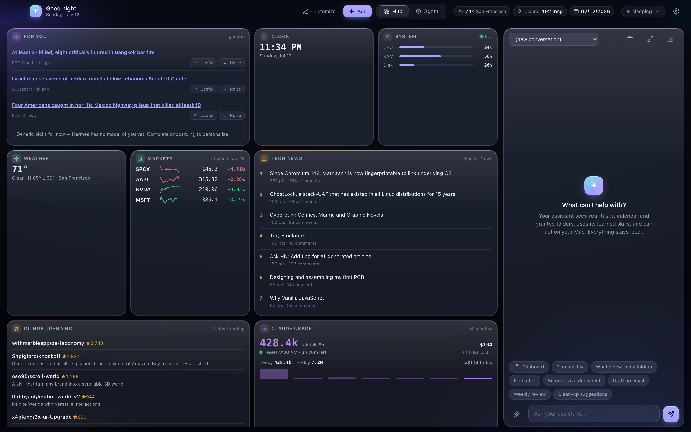
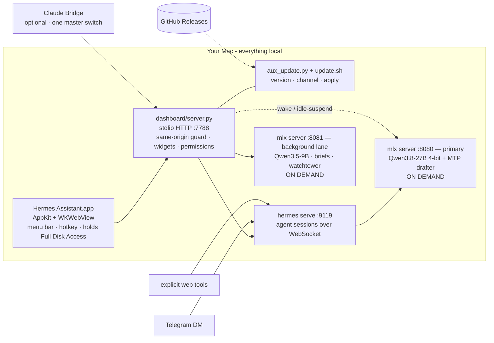

<div align="center">

# Hermes Assistant

**Your Mac becomes a private, always-on AI assistant.**

A standalone, Mac-first desktop app: a native AppKit shell around a local
tool-calling agent, a local MLX model, and a Liquid-Glass dashboard.
**Every token is generated on your machine.**

[](LICENSE)
[](https://github.com/Emran05/hermes-assistant-local/releases)
[](https://github.com/Emran05/hermes-assistant-local/actions/workflows/ci.yml)

-6b8afd)




*Live hub · news framing comparison · trend radar · local chat — model asleep in the corner, saving 22 GB of RAM.*

</div>

---

## Why

Cloud assistants know everything about you and forget you between sessions.
Hermes flips it: a **[Hermes agent](https://github.com/NousResearch/hermes-agent)
driving a 27B model on your own Apple Silicon**, with persistent memory,
graduated permissions, and a dashboard that's alive all day — briefing you,
watching your feeds, and acting on your Mac *with receipts for every action*.

No inference API keys. No token bills. No transcript leaves the machine.

## What it does

- **Standalone Mac app** — a native AppKit/WebKit shell that launches and
  babysits its own local services; menu-bar dropdown (weather · model state ·
  system meters) and a global-hotkey Quick Ask (⌃⌥Space).
- **World Brief** — an 8 am daily brief, a midday pulse, breaking alerts and an
  evening wrap, from a curated full spread of feeds (wire · public · left ·
  right · Mideast), hard-filtered to the last 24 hours.
- **Every Lens** — the same story as framed by each outlet's lean, side by side.
  *"Hardline war backer dies"* vs *"Trump ally dies"* — spot the spin instead of
  absorbing it.
- **Trend Radar** — which topics are *accelerating* across your feeds, from a
  rolling daily ledger. No model calls needed.
- **Two model lanes, both on demand** — a 27B primary for you, a small 9B for
  background work, neither running until something actually needs it.
- **Idle-suspend** — the primary sleeps after 10 idle minutes (frees ~22 GB) and
  wakes transparently on your next message.
- **Visible, editable memory** — read, edit and delete what the agent remembers
  about you. A flight recorder logs every tool call with one-click undo where
  possible.
- **Graduated trust** — 17 action classes, each Auto / Ask / Never, with hard
  floors. Nothing irreversible runs without your click.
- **Code knowledge graph** — optional [Graphify](https://github.com/Graphify-Labs/graphify)
  integration maps the repo into a queryable graph, synced to Obsidian as
  interlinked notes (`obsidian_sync.py`, `obsidian_daily.py`).
- **Modular widget hub** — 20+ widgets (markets, HN, GitHub trending, RSS,
  iMessage, Claude-plan usage…), each with a rich pop-out; add, remove, reorder.
- **Updates that come to you** — Settings › System & Data checks GitHub
  Releases, shows the notes, and applies the update with a live log.

## Architecture



- **Model:** Qwen3.8-27B (4-bit MLX) with its native speculative drafter —
  roughly twice the decode speed, ~17 GB resident. Swappable from the dashboard;
  the model menu handles download → verify → promote.
- **Backend:** one `server.py` on the Python standard library — no pip tree to
  rot. Features arrive as drop-in `aux_*.py` / `aux_*.js` modules.
- **Safety:** manual approvals by default, notify-only automations, read-only
  integrations where it matters (Gmail is draft-only *by absence of a send
  capability*, not by promise), and a same-origin guard in front of the whole
  local API.

## Requirements

- A Mac with **Apple Silicon** (M-series). There is no Intel path — MLX runs on
  the Apple GPU.
- **macOS 14** (Sonoma) or newer.
- **Xcode command line tools**: `xcode-select --install`.
- **Python 3.12+** on your PATH. The dashboard is stdlib-only, but it needs a
  modern one.
- **~25 GB of free disk** for the default model, and enough RAM to hold it —
  32 GB is comfortable, 64 GB is roomy. The model servers sleep when idle, so
  they only cost RAM while you are actually using the assistant.
- The **[Hermes Agent](https://github.com/NousResearch/hermes-agent) CLI**,
  installed separately (`install.sh` tells you how if it is missing).

## Install

```bash
git clone https://github.com/Emran05/hermes-assistant-local.git ~/HermesAssistant
cd ~/HermesAssistant
./install.sh --app
```

That preflights your machine, seeds `~/.hermes/.env` and `~/.hermes/config.yaml`
from the templates (never overwriting existing ones), builds the app, and
installs the launchd services. Run `./install.sh --dry-run` first if you want to
see the plan without touching anything.

Then:

1. `$EDITOR ~/.hermes/.env` — at minimum `TELEGRAM_BOT_TOKEN` and
   `TELEGRAM_ALLOWED_USERS` if you want the Telegram reach-in. `RUNBOOK.md`
   walks through every integration.
2. Open the dashboard at <http://127.0.0.1:7788>, or launch **Hermes
   Assistant.app**.
3. Pick a model in the header pill and let it download the first time (~17 GB).

**First launch of the app.** The bundle is ad-hoc signed, not notarised by
Apple, so double-clicking shows *"cannot be opened because the developer cannot
be verified"*. Right-click (or Control-click) **Hermes Assistant.app** in
`/Applications` → **Open** → **Open**. macOS remembers the choice.

**Full Disk Access.** The Message Center reads `~/Library/Messages/chat.db`,
which macOS protects. Grant it in **System Settings › Privacy & Security › Full
Disk Access › + › Hermes Assistant.app**, then relaunch. Note that *rebuilding*
the app changes its ad-hoc signature, so macOS treats it as a new app — you must
remove and re-add it there after every rebuild.

## Updating

Two paths, same script underneath:

- **Settings › System & Data › Software update** — shows your version, checks
  GitHub Releases, renders the release notes, and applies the update with a live
  log. The dashboard restarts itself and the app window reloads when it
  reconnects.
- **`./update.sh`** in the install directory, from a terminal. Add `--dry-run`
  to see the plan, `--target v1.1.0` for a specific release, `--rebuild-app` to
  also replace the app bundle.

Two channels, in Settings or via `--channel`:

| Channel | What it tracks |
|---|---|
| `stable` (default) | the newest `vX.Y.Z` release tag |
| `main` | `origin/main`, the development branch — git checkouts only |

The updater refuses to move a checkout with uncommitted changes (it tells you
which files), never touches anything under `~/.hermes`, leaves the model servers
asleep, and logs to `~/.hermes/logs/update.log`. If a release changes `app/`, it
says so rather than silently replacing a bundle whose Full Disk Access grant
would be dropped.

## Privacy

- **All inference is local.** Prompts, replies, memory and your calendar and
  mail content stay on the machine. The model server is a process on
  `127.0.0.1`, not an API key.
- **What does go out**, and only when you ask for it: Telegram transport (if you
  set it up), explicit agent tool calls like web search, weather and news feeds
  for the hub widgets, and the update check against the GitHub API.
- **The optional Claude Bridge** is the one path that sends text to a hosted
  model. It is off unless you turn it on, behind a single master switch.
- **The optional "Uncensored" model** (`Qwen3.8-27B-Uncensored`) is an
  abliterated build with its refusal behaviour removed. It is **opt-in**, never
  the default, and you pick it deliberately in the model menu. It is the same
  27B otherwise. What it writes is yours to own.
- **Google access is read-and-draft**: `calendar.readonly`, `gmail.readonly`,
  `gmail.compose`. There is no send scope, by design.
- **Battery.** The two model servers are installed **on demand**: they do not
  start at login and are not kept alive. A chat turn, a Telegram message, or
  "Wake now" starts the primary (~30-50 s cold); after ten idle minutes it
  suspends itself and hands back its ~22 GB. That is why the first message after
  a while is slow — it is not stuck.

## Design

The UI is a custom **Liquid Glass** system tuned for WKWebView: backdrop blur
and saturation, inset speculars, hairlines, and an ambient aurora the glass
refracts. Bespoke two-tone SVG glyphs everywhere — **zero emoji in the app** —
12-hour time, per-category accent colours, and `prefers-reduced-motion`
respected.

## Troubleshooting

Start with **[RUNBOOK.md](RUNBOOK.md)** — setup, integrations, and the "if
something breaks" section. Quick ones:

```bash
tail -f ~/.hermes/logs/dashboard.log        # the hub
tail -f ~/.hermes/logs/mlx-server.log       # the model
curl -s localhost:7788/api/version          # what am I running
curl -s localhost:8080/v1/models            # is the model up
launchctl kickstart -k gui/$(id -u)/com.hermes.dashboard   # restart the hub
hermes doctor                               # agent-side diagnosis
./install-services.sh --uninstall           # remove the services
```

After editing `dashboard/index.html` you must reload the app window (⌘R) — the
window caches the page, so restarting the service alone won't refresh it.

## Roadmap

- [x] Speculative decoding (~2× throughput on MLX) with a native MTP drafter.
- [x] A real update path — in-app checks plus `./update.sh`.
- [ ] **One-download `.app`** — bundle the model bootstrap and services into the
      app so there is no `install.sh` step; signed, notarised DMG.
- [ ] Voice in and out (local STT/TTS).
- [ ] Agent-authored widgets from a declarative `{url, template}` spec.
- [ ] Screenshot-grounded computer use with snapshot/undo on every action.

## Contributing

Issues and pull requests are welcome. CI compiles every Python file, parses
every shell script, syntax-checks every dashboard JS file, and fails on a
committed home-directory path — run those checks locally before you push.
`CLAUDE.md` is the architecture map and the list of hard-won gotchas; read it
before changing anything under `dashboard/`.

## Credits

Standing on: [NousResearch Hermes](https://github.com/NousResearch/hermes-agent) ·
[Apple MLX](https://github.com/ml-explore/mlx) ·
[Qwen](https://huggingface.co/Qwen) ·
[Graphify](https://github.com/Graphify-Labs/graphify)

## License

MIT — see [LICENSE](LICENSE). © 2026 Emran Nasseri. Placeholders like
`123456789`, `@your_hermes_bot` and `/Users/you` are yours to fill in.

Hermes Assistant is a wrapper around, and is not affiliated with, NousResearch's
Hermes Agent. Model weights are distributed by their own authors under their own
licenses.

<div align="center">

**If a private, always-on Mac assistant is something you want to exist — ⭐ this repo.**

</div>
